[正體中文](#zh-tw) | [English](#en)

<a id="zh-tw"></a>

# MultiAgentEpsilon

Vibe Coding 資安測試框架的第一個可執行試點：Python 3.12、FastAPI、PostgreSQL、Gitleaks 與確定性政策判定。使用合成資料驗證「缺陷能被攔截、修正版能通過、工具故障不能假綠」。

目前支援 Linux x86_64 與可用的 Docker daemon。這是測試平台與刻意含缺陷的測試標的；不應部署成正式服務，也未完成完整 ASVS、G0–G6 或多模型穩定性與偏誤驗收。

## 系統架構與流程（Architecture Overview）



[完整架構、安全測試／多模型／CI 流程與目錄結構](docs/architecture-overview.zh-TW.md)依已合併的實作整理。實線為已實作路徑；虛線依標籤表示 GLM 真實連線暫停、復原路徑或專用 App 尚待部署。模型報告僅供參考，ALLOW／BLOCK 仍由確定性政策及外部 oracle 判定。

```text
MultiAgentEpsilon/
├── .github/             CI 工作流程與 CODEOWNERS
├── deploy/              專用檢查發布器的部署範本
├── docs/                架構、覆蓋、操作與驗收文件
│   └── diagrams/        Mermaid 原始圖與可分享的 SVG
├── fixture_app/         受測的合成 FastAPI 應用
├── scripts/             安裝、執行、回收與治理入口
├── security/            政策、工具鎖定、RoE 與合成案例
├── security_harness/    可信評估、隔離、掃描與證據核心
│   └── llm/             模型 gateway、adapter、盲審與評分
├── tests/               契約、缺陷變體與隔離回歸
├── requirements.lock    固定版本與套件雜湊
├── requirements.in      套件宣告
├── pyproject.toml       Python 與 pytest 設定
└── SECURITY.md          資安回報及處理範圍
```

此為主要目錄摘要；[完整檔案樹與本機生成目錄](docs/architecture-overview.zh-TW.md#目錄結構)另行列出。

## 開始執行

在專案目錄執行：

```bash
python3 -I scripts/bootstrap.py
python3 -I scripts/install_test_tools.py
python3 -I scripts/build_runtime.py
python3 -I scripts/dev_db.py start
.venv/bin/python -m pytest --junitxml=artifacts/pytest.xml
.venv/bin/python -I scripts/smoke_http.py
.venv/bin/python -I scripts/expect_block.py
.venv/bin/python -I scripts/run_security.py
```

`bootstrap.py` 先核對 PyPI 套件、固定版本、所有 lock 雜湊、7 天冷卻期與 wheel 可用性；驗證 Gitleaks 官方 release checksum 及固定 binary digest，再跑 G2。成功後才下載與安裝 hash-verified wheels，禁用 source builds、額外 index 與隱含依賴解析。首版使用明確核准的 23 個套件；依賴更新需重新審查，不自動擴充 allowlist。

`build_runtime.py` 以固定 digest 的 Python 映像及已核對 hash 的 wheels 離線建立容器 runtime。`run_security.py` 在無網路、非 root、唯讀根檔案系統的容器執行候選程式。HTTP socket 位於容器的限額 tmpfs，由容器內 bridge 連線，透過有時間／大小限制的 Docker exec 通道傳回不可信回應；host 不解析候選控制的 socket 路徑。可信評分器在容器外核對回應與資料庫副作用。候選 lock 必須與受測 runtime 一致；依賴變更須先更新可信基準並重建。詳見 [可信執行與合併保護](docs/trusted-execution.zh-TW.md)。

`dev_db.py` 的 loopback 資料庫供本地開發與可信基準測試使用；隔離評分會另外建立無網路資料庫與最低所需權限的應用帳號，完成後移除。所有資料均為合成資料。

`expect_block.py` 會確認缺陷版**恰好**違反政策 `seeded_defect_case_ids` 指定的 **9 個授權案例**（bob／carol 越權讀寫刪除各一、admin 跨租戶讀取、寫入與刪除）；數量相同但換成別的案例、或任意工具錯誤都不算成功。`run_security.py` 預設跑修正版，回傳碼 0 表示這次有限試點 ALLOW，1 表示 BLOCK。`ERROR`、`TIMEOUT`、必要零目標、缺 gate、過期或不同 subject／policy 的證據都不能 ALLOW。正向操作及資料庫副作用也會一起驗證。

結果 schema 為第 3 版，拒絕舊版 gate 證據：每筆 gate 綁定相同 run ID、subject 與 policy digest。subject 使用 `worktree-manifest-v1`，雜湊明確編碼的逐檔路徑、型態、執行權限、大小及內容 SHA-256。AUTH 必須包含政策指定的唯一案例集合；缺漏、重複、未知 ID 或彙總不一致均 BLOCK。

AUTH 有 32 個必要案例，包含錯誤密碼及不存在帳號，以及 admin 的同租戶寫入（允許）與跨租戶寫入（拒絕且無副作用）。拒絕回應、讀取及匯出依合成 API 契約比對完整 JSON，拒絕重複 key；每個案例核對完整 users／items／sessions 快照與允許的變更。這是合成 fixture 的契約，不是任意 API 的通用回應規則。七種已重現缺陷（含 admin 寫入條件越過租戶邊界）的真實隔離回歸見 `tests/test_adversarial_authorization.py`。

每次執行在解析設定前建立 `artifacts/<run-id>/report.json`；錯誤只保存階段與例外類型，不記錄敏感例外文字。`artifacts/latest.txt` 是 security run 索引；bootstrap、preflight 與 runtime-build 使用各自的索引。這些是未簽章的執行證據，不是可信 attestation。停止並刪除本地開發資料庫：

```bash
python3 -I scripts/dev_db.py stop
```

## 試點範圍

| 元件 | 已實作範圍 | 尚未涵蓋 |
|---|---|---|
| G0／G4 | [試點授權矩陣與威脅](docs/pilot-scope.zh-TW.md) | 真實應用 owner、完整威脅建模及適用性核准 |
| G1 | PyPI metadata、固定版本／hash、冷卻期、wheel-only；鎖定檔 CycloneDX SBOM、OSV 精確版本漏洞查詢 | 安裝映像清冊、KEV／EPSS、惡意套件行為、其他生態系 |
| G2 | 真實 Gitleaks、遮罩、工作樹及候選 HEAD 可達 blobs、限額 gzip／zip／tar 展開 | 服務端 Push Protection、遠端不可得歷史／快取、金鑰撤銷 |
| 授權回歸 | 登入負例、同角色、跨租戶、管理者讀寫、欄位限制、登出及完整 fixture 狀態；32 個案例 | 完整 G5／Web/API 黑箱掃描、TLS／CSRF／JWT／SSRF |
| 政策與證據 | 嚴格結果格式、故障阻擋、subject／policy digest、基準變更檢查、CI 簽章與來源驗證 | 專用可信發布器正式部署、例外生命週期、普通開發者的完整遠端繞過驗收 |
| CI | 遠端 main／PR 正反例、固定 actions SHA、最小權限、早期拒絕證據與清理；main 規則已讀回 | 專用可信來源尚未部署，普通開發者繞過驗收仍未完成 |
| 多模型 | [受限 gateway 與模型 adapter](docs/model-gateway.zh-TW.md)、[合成盲測與裁決試點](docs/blind-review.zh-TW.md) | GLM 真實推論、兩個真實家族的多輪穩定性、完整 G6／偏誤驗收 |

[結構化輸出驗收](docs/structured-output.zh-TW.md)已完成 Gemini／Claude 對 B09～B12 的一輪真實配對：八個回應有效，分類與弱點行號皆符合標準答案；這不等於多輪穩定性或偏誤改善。

模型 runner 也由 supervisor 管理，成功結果需待清理完成才發布；SIGKILL 後使用 `scripts/cleanup_runs.py` 回收登記的 worker／AWS 程序群組。正式證據位於 `artifacts/<run-id>/report.json`，模型結果仍僅供參考。

G2 與 subject digest 共用輸入清冊：生成物名稱只在 repository 根目錄排除，巢狀同名來源仍納入；Python／pytest 快取另行排除，任何已追蹤的保留生成路徑會拒絕執行。來源 symlink、不可讀目錄、輸入超限及雜湊時檔案變動會拒絕。Gitleaks 的掃描快照重新命名並映射回原路徑，避免工具的隱含目錄排除縮減範圍，且不接受候選的 inline allow 註解。Git 歷史以候選 repository 自己的 HEAD 可達的全部 blobs 為範圍，且為必要條件：淺層 clone、沒有 `.git`、沒有 commit，或位於外層 repo 中的子目錄都會阻擋。對候選的 git 呼叫停用 fsmonitor、hooks 與 transport，候選的 `.git/config` 不能讓 host 執行程式。gzip／zip／tar 依限額展開，容器本身的註解、檔名與 extra 欄位也一併掃描；不支援、損壞、加密、超限，或含有未列出成員位元組的內容會阻擋。二進位檔預設阻擋；需先把內容的 SHA-256 經審查加入 evaluator 端受保護的 `security/binary-allowlist.json`，之後仍以 ASCII／UTF-16LE 可讀字串掃描內嵌機密，內容一改就需重新審查。排除的依賴／暫存內容與其他 refs 不宣稱已掃描。

## CI 啟用界線

[security.yml](.github/workflows/security.yml) 改用 `pull_request_target`，只執行 base SHA 的 evaluator、安裝程序與測試；候選 checkout 僅作資料，只有限定的 `fixture_app` 來源會送入無網路容器。評估工作的 token 權限為 contents/read、pull-requests/read 與 actions/read，不提供模型或部署金鑰；獨立簽署工作另有 id-token/write 與 attestations/write。所有路徑（包含 fixture、README 與文件）都須經可信、具寫入權限的獨立審查者對最新 head 核准。main push 與手動執行亦使用同一評分路徑；手動選取的 workflow ref 代表維護者選定的 evaluator，不能自動當成已核准基準。因此 main 上的 workflow 手動執行時，檢查名稱固定為 `manual-security-evaluation`、artifact 為 `manual-security-*`。`workflow_dispatch` 使用所選 ref 的 YAML，有推送權限者在自己分支改掉 job 名稱仍可產生同名檢查，所以審查者仍須以下述工具核對來源。執行完畢前，CI 會用發布程式的同一套證據契約自我檢查（`check_publishable_evidence.py`），證據與契約不一致時該 run 直接失敗。

新執行入口預設受保護。基準更新需由可信 reviewer 對目前 head SHA 獨立核准；guard 即時查核 GitHub PR／reviews，撤回核准、換版或作者自行核准皆不放行。此 run 仍以舊基準判定，合併後才成為下一輪基準。

**main 規則集 24512048 已啟用並讀回確認。** 必要檢查仍使用共用 GitHub Actions App 15368；名稱與 App ID 無法唯一識別可信 workflow：有推送權限者可以用自己的 workflow，回訪的 fork 貢獻者也能以 `on: pull_request` 產生同名綠燈。`pull_request_target` 執行的是 PR **base 分支**上的 workflow，同一路徑在其他分支的修改版本有相同 workflow ID。專用 App 綁定前，審查者在核准或合併前應執行 `python3 -I scripts/verify_required_check.py --pr <編號>`：它以 GitHub 的 run 中繼資料確認 PR head 上每一個 `trusted-security-pilot` 都來自可信 workflow 路徑的 `pull_request_target` run，run 的 head 分支與此 PR 相同，且沒有任何（含已關閉）共用同一 head、卻開到其他分支的 PR；任一條件不符即 BLOCK。[專用 App 發布程式與部署範本](docs/trusted-check-publisher.zh-TW.md)已準備，App 與服務尚未部署。基準遷移程序見 [操作文件](docs/trusted-execution.zh-TW.md)，先前遠端基線見 [驗收紀錄](docs/remote-ci-validation.zh-TW.md)。

PR #18 已獲獨立核准並合併至 `main`（`218fd7a`）。合併後的 [CI 執行 37866429806](https://github.com/chinchiang/MultiAgentEpsilon/actions/runs/37866429806) 通過 883 項測試，修正版 32 個案例／0 項缺陷為 ALLOW，指定缺陷版 32 個案例／9 項缺陷為 BLOCK；清理、證據摘要與真實簽章均已核對。專用 GitHub App 部署與真實 LM Studio 驗收仍待完成。

## 離線突變與性質測試

[自動突變與 Hypothesis 操作說明](docs/mutation-testing.zh-TW.md)涵蓋政策、證據 JSON 與模型回應判定。安裝測試工具後可離線執行；存活突變、逾時與工具錯誤均使 CI 失敗。

## 文件與來源

- [系統架構、執行流程與完整目錄結構](docs/architecture-overview.zh-TW.md)
- [試點範圍、授權矩陣與限制](docs/pilot-scope.zh-TW.md)
- [實作現況與剩餘待辦](docs/milestone-status.zh-TW.md)（[歷史紀錄](docs/milestone-history.zh-TW.md)）
- [可信執行、基準更新與合併保護](docs/trusted-execution.zh-TW.md)
- [遠端合併保護：設定與驗收缺口](docs/remote-merge-protection.zh-TW.md)
- [專用檢查發布程式與部署範本](docs/trusted-check-publisher.zh-TW.md)
- [遠端 CI 驗收及可套用的保護規則](docs/remote-ci-validation.zh-TW.md)
- [覆蓋與生命週期驗收](docs/coverage-lifecycle-acceptance.zh-TW.md)
- [ASVS 覆蓋對照](docs/asvs-coverage.zh-TW.md)
- 多模型：[gateway](docs/model-gateway.zh-TW.md)、[盲測與裁決](docs/blind-review.zh-TW.md)、[多輪盲測](docs/repeated-review.zh-TW.md)、[結構化輸出](docs/structured-output.zh-TW.md)

公開版本只包含程式碼、合成測試及操作文件。使用者提供的附件、內部研究／治理文件及其衍生表單保留於本地，不包含於公開 Git 歷史。當前完成度以 milestone status 為準；少量示範案例不代表符合完整 [OWASP ASVS](https://owasp.org/www-project-application-security-verification-standard/)。

掃描格式、總資源限制、SIGTERM／SIGINT／SIGKILL 清理回歸，以及遠端合併保護尚缺的前提，見 [覆蓋與生命週期驗收](docs/coverage-lifecycle-acceptance.zh-TW.md)。

新增越權、路徑穿越及 SSRF 的合成配對案例可用 `scripts/model_review.py --suite boundaries` 離線執行；行為反例、ASVS 5.0.0 對照與未涵蓋範圍見 [覆蓋對照](docs/asvs-coverage.zh-TW.md)。這些案例不代表正式應用已完成相同驗證。

可用 `--rounds` 在同一總預算內執行重複盲測；逐輪結果、失敗分類與穩定性判讀見 [多輪盲測文件](docs/repeated-review.zh-TW.md)。

本輪修正與完整驗收記錄見[安全邊界修正](docs/security-boundaries-20261008.zh-TW.md)。已產生簽章或通過本機測試，仍須完成專用 App 的部署、Ruleset 來源綁定與遠端驗收。

本輪新增依賴漏洞閘門、刪除／過期工作階段案例及模型變體的範圍、證據與部署缺口，見[後續擴充紀錄](docs/security-expansion-20261008.zh-TW.md)。PR #16／#17 已獨立核准並合併；正式 main `438d7a4` 的 787 項測試、32／0 正例、32／9 指定缺陷與簽章均已驗收。本輪 LM Studio 與雙語變更則須另經審查與驗收。

LM Studio／Nemotron 的連線限制、操作及待實測項目見 [LM Studio 指南](docs/lmstudio.zh-TW.md)；本輪稽核與回歸見 [稽核修正紀錄](docs/audit-20261009.zh-TW.md)。

<a id="en"></a>

# MultiAgentEpsilon — English

An executable security-testing pilot for Vibe Coding: Python 3.12, FastAPI, PostgreSQL, Gitleaks, and deterministic policy decisions. Synthetic fixtures demonstrate that seeded defects are blocked, fixed code passes, and tool failures cannot become false passes. Supported execution is Linux x86_64 with Docker. This is a test harness containing deliberately vulnerable targets, not a production service or a claim of complete ASVS, G0–G6, stability, or bias acceptance.

## Architecture and repository layout


The [architecture, flows, and full tree](docs/architecture-overview.zh-TW.md#en) describe implemented paths and explicitly marked pending deployment/live validation. Models provide advisory reviews; deterministic gates and an external oracle decide ALLOW/BLOCK.

| Directory | Purpose |
|---|---|
| `.github/` | Protected CI workflow and CODEOWNERS |
| `deploy/` | Dedicated check-publisher deployment templates |
| `docs/`, `docs/diagrams/` | Bilingual architecture, scope, operations, evidence; Mermaid and SVG |
| `fixture_app/` | Synthetic FastAPI target |
| `scripts/` | Installation, execution, cleanup, and governance entry points |
| `security/` | Policies, tool pins, rules of engagement, synthetic cases and reference answers |
| `security_harness/`, `security_harness/llm/` | Trusted evaluation, isolation, scanning, evidence; bounded model adapters and scoring |
| `tests/` | Contracts, seeded variants, isolation, and regression tests |
| `requirements.in`, `requirements.lock`, `pyproject.toml` | Declared dependencies, version/hash lock, Python/pytest configuration |
| `SECURITY.md` | Security-reporting scope and channel availability |

## Run the pilot

```bash
python3 -I scripts/bootstrap.py
python3 -I scripts/install_test_tools.py
python3 -I scripts/build_runtime.py
python3 -I scripts/dev_db.py start
.venv/bin/python -m pytest --junitxml=artifacts/pytest.xml
.venv/bin/python -I scripts/smoke_http.py
.venv/bin/python -I scripts/expect_block.py
.venv/bin/python -I scripts/run_security.py
python3 -I scripts/dev_db.py stop
```

Bootstrap validates the approved 23-package inventory against PyPI identity, pinned versions, all lock hashes, a seven-day cooling period, and wheel availability. It verifies the scanner's release checksum and pinned binary digest, runs G2, and checks exact-version OSV results before installation. Only verified wheels are installed, with hashes required and source builds, extra indexes, and implicit dependency resolution disabled. Dependency updates require review.

The runtime uses a pinned Python image and verified wheels in an offline build. Candidate code runs in a non-root container with no network and a read-only root. A bounded bridge inside the container sends HTTP to a socket in limited tmpfs; the host never connects through a candidate-controlled socket path. The host oracle checks complete responses and database side effects. The candidate lock must match the tested runtime lock. The development database is loopback-only; isolated evaluation creates a separate networkless database with least-privilege application credentials and removes it afterwards. All data is synthetic.

`expect_block.py` requires exactly the nine policy-listed defects: unauthorized read/write/delete by bob and carol, and cross-tenant read/write/delete by admin. A different set with the same count, or a tool error, does not pass. The fixed pipeline returns 0 for this bounded pilot's ALLOW and 1 for BLOCK. ERROR, TIMEOUT, zero required targets, missing gates, stale evidence, and mismatched run/subject/policy bindings cannot pass. Positive actions and full database side effects are also checked.

Evidence schema 3 uses a `worktree-manifest-v1` digest over explicit paths, types, executable classification, sizes, and SHA-256 content. AUTH requires the exact unique set of 32 cases and consistent case/finding totals. Cases cover login failures, ownership, tenants, admin delegation, field changes, logout, expiration, deletion, and input boundaries. Full JSON and users/items/sessions snapshots are checked. These are contracts of the synthetic API, not universal API rules. Seven concrete mutation families have isolated regressions.

Reports are created before configuration parsing at `artifacts/<run-id>/report.json`; failures store stages and exception types, not sensitive exception text. `latest.txt` points only to security runs; other operations have separate indexes. Local reports are unsigned. CI separately signs its uploaded evidence ZIP. Model supervision records workers/AWS groups before execution, publishes completion after cleanup, and supports later janitor recovery after SIGKILL.

## Implemented scope and remaining work

| Area | Implemented | Not yet established |
|---|---|---|
| G0/G4 | Synthetic scope, authorization matrix, threat examples | Product owner, full threat model, approved applicability |
| G1 | PyPI provenance, pinned hashes, cooling, wheel-only installation, declared-lock CycloneDX SBOM, OSV queries | Installed-image inventory, KEV/EPSS, malicious-package behavior, other ecosystems |
| G2 | Gitleaks; worktree and candidate-HEAD history; bounded gzip/ZIP/tar expansion and metadata scanning | Server-side push protection, unavailable history/caches, credential revocation |
| AUTH | 32 synthetic authentication/authorization and side-effect cases | Complete product DAST, TLS, CSRF, JWT, SSRF testing |
| Policy/evidence | Strict contracts, failure blocking, digests, protected changes, CI signatures and source verification | Dedicated publisher deployment, exception lifecycle, complete developer-role remote probes |
| Models | Mock, Gemini, Bedrock, GLM interfaces; new LM Studio text interface and batch comparison | Real LM Studio/Nemotron acceptance, paused GLM, larger cross-family stability/bias studies |

G2 and subject hashing share one input inventory. Generated directories are excluded only at the repository root; nested names remain source. Python/pytest caches are explicit exclusions; tracked reserved generated paths are rejected. Symlinks, unreadable paths, changing inputs, and limits fail closed. Renamed scan snapshots defeat scanner implicit exclusions and candidate inline allow comments. History must come from the candidate's own non-shallow repository and actual HEAD; no `.git`, no commit, gitfiles, or accidental enclosing repositories are rejected. Candidate Git calls disable hooks, fsmonitor, and transports.

gzip/ZIP/tar expansion is bounded and also scans comments, names, extra fields, and headers. Unsupported, corrupt, encrypted, oversized, or unlisted trailing content blocks. Binaries require a reviewed content hash in the evaluator's allowlist, then readable ASCII/UTF-16LE strings are scanned. A changed binary requires review again. Excluded dependencies, caches, and other refs are not claimed as covered.

## CI and merge boundaries

`pull_request_target` executes the base evaluator, installation, and tests. Candidate checkout is data; only scoped fixture Python reaches a networkless container. Evaluator permissions are read-only for contents, PRs, and Actions; no model/deployment keys are supplied. A fresh signing job holds OIDC/attestation write permissions. The final `trusted-security-pilot` succeeds only after evaluation and signing succeed. Manual runs use distinct names and cannot replace the formal required check. CI validates its evidence with the publisher's contract before upload.

Every path, including fixture and documentation, requires an independent, write-capable trusted reviewer approving the current head. Live GitHub checks reject stale/dismissed/self approvals and contributors to the PR commits. A baseline update is evaluated by the old baseline; only after legitimate merging does it become the next baseline.

Ruleset 24512048 is active without bypass, but the shared Actions App 15368 and a check name do not uniquely identify a trusted workflow. Until the dedicated App is deployed, run `python3 -I scripts/verify_required_check.py --pr <number>` before approval/merge. It validates every same-named check's event, workflow, head repository/branch, whole-run success, and absence of another-base or retargeted PR sharing that head, including closed PRs. See the [publisher guide](docs/trusted-check-publisher.zh-TW.md#en). App deployment and developer-role denial acceptance remain pending.

PR #18 received independent approval and merged into `main` (`218fd7a`). Post-merge [CI run 37866429806](https://github.com/chinchiang/MultiAgentEpsilon/actions/runs/37866429806) passed 883 tests: the fixed target allowed all 32 cases with zero findings, and the seeded target was blocked with exactly nine findings among 32 cases. Cleanup, evidence digests, and real signatures were verified. Dedicated GitHub App deployment and real LM Studio acceptance remain pending.

## Offline mutation and property tests

[Automatic mutations and Hypothesis](docs/mutation-testing.zh-TW.md#en) cover policy, evidence JSON, and model response predicates. Runs are offline after tool installation; survivors, timeouts, and infrastructure errors fail CI.

## Reading and model operations

- [Current milestones](docs/milestone-status.zh-TW.md#en), [history](docs/milestone-history.zh-TW.md#en), [scope](docs/pilot-scope.zh-TW.md#en), [ASVS mapping](docs/asvs-coverage.zh-TW.md#en).
- [Trusted execution](docs/trusted-execution.zh-TW.md#en), [remote protection](docs/remote-merge-protection.zh-TW.md#en), [CI evidence](docs/remote-ci-validation.zh-TW.md#en), [coverage/cleanup](docs/coverage-lifecycle-acceptance.zh-TW.md#en).
- [Gateway](docs/model-gateway.zh-TW.md#en), [blind reviews](docs/blind-review.zh-TW.md#en), [repeated reviews](docs/repeated-review.zh-TW.md#en), [structured output](docs/structured-output.zh-TW.md#en), [LM Studio](docs/lmstudio.zh-TW.md#en).
- [Boundary fixes](docs/security-boundaries-20261008.zh-TW.md#en), [dependency/AUTH expansion](docs/security-expansion-20261008.zh-TW.md#en), [current audit](docs/audit-20261009.zh-TW.md#en).

`model_review.py --suite boundaries` runs offline paired authorization/path/SSRF examples; `--rounds` shares a bounded total budget. Historical B09–B12 Gemini/Claude live pairs had valid classifications and locations, but do not establish larger-sample stability or bias reduction. The catalog is now v3; prior v2 results remain historical. Model outputs never decide security gates.

The public repository contains code, synthetic tests, and operational documentation. User attachments, internal research/governance documents, derived forms, and old private history stay local. Demonstration coverage does not establish full [OWASP ASVS](https://owasp.org/www-project-application-security-verification-standard/) compliance.
