[正體中文](#zh-tw) | [English](#en)

<a id="zh-tw"></a>

# 系統架構與流程（Architecture Overview）

正式 main `8b028cb9914786dee293329a5d028e8a5a91112b` 已合併 PR #19，完成 883 項測試、32 個 AUTH 案例及 9 個指定缺陷的正反例與簽章驗收（[run 37877260388](https://github.com/chinchiang/MultiAgentEpsilon/actions/runs/37877260388)）。LM Studio 文字介接器、分批比較與雙語文件已合併，地端真實模型尚未驗收。本輪新增[離線突變與性質測試](mutation-testing.zh-TW.md)，仍須獨立審查。系統為 Python 3.12 資安測試試點，由命令列、GitHub Actions、隔離容器與模型介接器組成；多模型採獨立盲審、循序呼叫與本機評分。

圖中的實線表示已實作的執行或資料關係；虛線表示暫停、復原或尚待部署的路徑，依節點標示判讀。圖表使用 Mermaid 原始檔，另提供可直接開啟與分享的 SVG。

## 系統架構總覽


[Mermaid 原始檔](diagrams/architecture-overview.mmd) · [開啟 SVG](diagrams/architecture-overview.svg)

| 路徑 | 目前作用 | 狀態與邊界 |
|---|---|---|
| 確定性測試 | G1 套件來源／OSV 漏洞驗證、G2 機密掃描、32 個 AUTH 授權案例，再由政策判定 ALLOW／BLOCK | 已實作；AUTH 僅評估合成 FastAPI fixture，必要 gate 故障即阻擋 |
| 多模型盲審 | 固定合成程式送給選定模型，驗證回答、對照本機標準答案並比較分歧 | Gemini／Claude Sonnet 已完成 B09～B12 真實配對；GLM 保留離線回歸，真實連線暫停；LM Studio 文字介面離線完成、真實待驗收；模型結果僅供參考 |
| CI 與證據簽署 | base evaluator 評估 head candidate，獨立 runner 簽署證據 ZIP 摘要 | 已運作；不把候選 checkout 的工具、政策或測試匯入受信任 host |
| 遠端合併保護 | 最新 head 獨立核准、正式必要檢查與來源驗證 | `main` 規則集 24512048 啟用、無 bypass；必要來源仍為共用 Actions App 15368 |
| 專用檢查發布器 | 受控主機讀取 GitHub 證據及審查狀態，驗證後發布 `epsilon/trusted-merge` | 程式、設定及 systemd 範本已備妥；App、主機及 Ruleset 綁定尚未部署 |

`run_security.py` 與 `model_review.py` 是兩個獨立入口。確定性測試不會自動呼叫 LLM，模型也不決定 AUTH 或合併是否放行。B09～B12 的路徑穿越／SSRF 行為反例由測試集驗證；它們不是 `run_security.py` 對任意網站執行的黑箱掃描器。

## 確定性安全測試流程



[Mermaid 原始檔](diagrams/security-flow.mmd) · [開啟 SVG](diagrams/security-flow.svg)

1. `scripts/run_security.py` 先建立 run ID 與初始證據，再由 supervisor 登記擁有者及程序群組；持久化握手完成後才允許 worker 執行。
2. worker 從受信任基準讀取 RoE、政策與工具設定，核對候選輸入及清冊摘要。G1 查核候選 lock 的套件資料、產生鎖定檔 SBOM 並向 OSV 查詢每個固定版本，G2 使用真實 Gitleaks 掃描工作樹、候選 HEAD 可達內容、提交／標籤中繼資料及限額封存展開。
3. G1／G2 完成且零 findings 才執行 AUTH。隔離 runtime 核對映像、可信啟動器與候選 lock，僅將受限的 `fixture_app/*.py` 來源送入 app 容器。
4. 可信 oracle 在容器外透過 Docker exec 啟動容器內 HTTP bridge，並獨立查詢 PostgreSQL，核對 32 個授權案例的完整回應與資料庫副作用。
5. worker 的結果先保持 `AWAITING_CLEANUP`；父程序確認所屬程序群組、容器及暫存目錄已清理，才發布最終結果。設定錯誤、缺 gate、過期證據、摘要不一致或清理失敗均 BLOCK。

app 與隔離 DB 都使用 `--network=none`，透過共享的 PostgreSQL Unix socket 通訊。app 為非 root、唯讀根目錄，無 Linux capabilities，具 CPU／記憶體／PID／tmpfs 限額，只取得合成最低權限 DB 帳號。容器外 oracle 使用自己的可信 seed 與連線；候選不能修改評分器、政策或最終報告。

`scripts/dev_db.py` 另提供 loopback PostgreSQL，供本機開發與可信回歸使用；它與每次隔離評估建立的 DB 容器分開。服務不因安裝完成而自動常駐。取消與一般逾時由 supervisor 清理；擁有者遭 SIGKILL 後由 `scripts/cleanup_runs.py` 依 UID、boot ID、PID 起始時間及回收清冊處理。

## 多模型盲審流程



[Mermaid 原始檔](diagrams/model-review-flow.mmd) · [開啟 SVG](diagrams/model-review-flow.svg)

`security/review-cases.json` 包含 B01～B16 的固定合成案例；`security/review-oracle.json` 是留在本機的標準答案。同一案例、同一輪給不同模型相同內容與不透明識別碼，請求不含案例 ID、逐案 CWE 提示、標準答案或其他模型回答。呼叫依已建立的計畫循序執行；需要真實 API 時必須明確指定 `--live`。

Gateway 在 API I/O 前持久化 call ID、請求摘要及輸出詞元預留，再交給 adapter。Gemini 使用 HTTP `generateContent`，Claude 使用 AWS CLI 的 Bedrock Converse，LM Studio 先查核精確模型 ID 再使用 OpenAI 相容文字介面；adapter 輸出仍須通過本機 JSON、引用、行號、最多三項 findings 與判定一致性驗證。Bedrock 不傳送不支援的 `maxItems`，本機三項上限維持不變。

每批最多 16 個計畫呼叫、8,192 個預留輸出詞元；盲審每次呼叫期限 30 秒，整批依計畫計算且不超過 130 秒。失敗、拒答與截斷保留在分母中，不自動重試、不自動切換模型；缺少回報的用量維持未知。`COMPLETE` 只表示全部審查、證據驗證與清理完成，不表示產品安全或偏誤降低。人工註記綁定精確報告，但目前未驗證註記者身分，也不改寫 gate 或 oracle。

## GitHub CI 與合併流程



[Mermaid 原始檔](diagrams/ci-flow.mmd) · [開啟 SVG](diagrams/ci-flow.svg)

PR 使用 `.github/workflows/security.yml` 的 `pull_request_target`：evaluator、安裝程序、測試、政策及 oracle 取自 base SHA；head checkout 僅作候選資料。所有路徑（含本文件）都須可信、具寫入權限的獨立審查者核准精確 head。作者、PR commit 身分及 run actor／triggering actor 不計入獨立核准，具寫入權限者要求修改會阻擋。

完整回歸、缺陷反例、候選評估與 `check_publishable_evidence.py` 通過後，CI 上傳 evaluator-owned 證據。獨立簽署工作在全新 runner 上只接收 ZIP 摘要，不 checkout 候選、不接觸模型或部署憑證。評估工作失敗時仍保留證據並清理，簽署工作不執行。

`main` push 使用提交本身的 evaluator；手動執行使用所選 workflow ref，檢查名稱為 `manual-security-evaluation`。手動成功不等於正式必要檢查。專用 App 上線前，合併仍須以 `verify_required_check.py` 核對檢查來源、PR head 分支及完整 base 歷程；同一 head 範圍曾改 base 會保守拒絕。

已合併的 [PR #15](https://github.com/chinchiang/MultiAgentEpsilon/pull/15) 及 [main CI 37737568083](https://github.com/chinchiang/MultiAgentEpsilon/actions/runs/37737568083) 是先前版本的歷史證據：704 項回歸通過，修正版 ALLOW／0 findings、缺陷版 BLOCK／6 findings，清理完成；實際 ZIP 摘要、main 簽章及 run attempt 均已核對。此證據適用於該提交，不自動授權後續版本。

## 元件與程式對照

| 元件 | 主要程式／設定 |
|---|---|
| 安裝與離線 runtime | [`bootstrap.py`](../scripts/bootstrap.py)、[`build_runtime.py`](../scripts/build_runtime.py)、[`requirements.lock`](../requirements.lock)、[`tools.lock.json`](../security/tools.lock.json) |
| 安全測試入口與 worker | [`run_security.py`](../scripts/run_security.py)、[`security_worker.py`](../scripts/security_worker.py)、[`audit.py`](../security_harness/audit.py) |
| RoE、輸入、摘要與政策 | [`scope.py`](../security_harness/scope.py)、[`inputs.py`](../security_harness/inputs.py)、[`results.py`](../security_harness/results.py)、[`roe.json`](../security/roe.json)、[`policy.json`](../security/policy.json) |
| G1／G2 | [`preflight.py`](../security_harness/preflight.py)、[`dependencies.py`](../security_harness/dependencies.py)、[`secrets.py`](../security_harness/secrets.py)、[`scan_content.py`](../security_harness/scan_content.py)、[`candidate_git.py`](../security_harness/candidate_git.py) |
| 隔離與外部 oracle | [`isolation.py`](../security_harness/isolation.py)、[`container_http.py`](../security_harness/container_http.py)、[`authorization.py`](../security_harness/authorization.py)、[`fixture_database.py`](../security_harness/fixture_database.py)、[`fixture_app/app.py`](../fixture_app/app.py) |
| 程序生命週期與回收 | [`lifecycle.py`](../security_harness/lifecycle.py)、[`limits.py`](../security_harness/limits.py)、[`cleanup_runs.py`](../scripts/cleanup_runs.py)；模型另用 [`llm/lifecycle.py`](../security_harness/llm/lifecycle.py) |
| 模型 transport／adapter | [`gateway.py`](../security_harness/llm/gateway.py)、[`adapters.py`](../security_harness/llm/adapters.py)、[`transport.py`](../security_harness/llm/transport.py)、[`output_schema.py`](../security_harness/llm/output_schema.py) |
| 盲審、評分與註記 | [`model_review.py`](../scripts/model_review.py)、[`benchmark.py`](../security_harness/llm/benchmark.py)、[`benchmark_runner.py`](../security_harness/llm/benchmark_runner.py)、[`benchmark_score.py`](../security_harness/llm/benchmark_score.py)、[`review_adjudicate.py`](../scripts/review_adjudicate.py) |
| 可信審查與 CI 證據 | [`check_trusted_changes.py`](../scripts/check_trusted_changes.py)、[`verify_required_check.py`](../scripts/verify_required_check.py)、[`write_ci_provenance.py`](../scripts/write_ci_provenance.py)、[`check_publishable_evidence.py`](../scripts/check_publishable_evidence.py) |
| 尚待部署的發布器 | [`trusted_publisher.py`](../security_harness/trusted_publisher.py)、[`publish_trusted_check.py`](../scripts/publish_trusted_check.py)、[`prepare_publisher_deployment.py`](../scripts/prepare_publisher_deployment.py)、[`deploy/trusted-publisher/`](../deploy/trusted-publisher/) |

## 目錄結構

以下列出受版本管理的完整目錄與檔案，包含本次新增圖表；`__init__.py` 為 Python 套件入口。生成物、套件快取、Git 內部資料與私人附件不列入原始碼目錄樹。

<!-- repository-tree:start -->
```text
MultiAgentEpsilon/
├── .github/
│   ├── workflows/
│   │   └── security.yml
│   └── CODEOWNERS
├── deploy/
│   └── trusted-publisher/
│       ├── epsilon-publisher@.service
│       ├── epsilon-publisher@.timer
│       └── github-app-permissions.json
├── docs/
│   ├── diagrams/
│   │   ├── architecture-overview.mmd
│   │   ├── architecture-overview.svg
│   │   ├── ci-flow.mmd
│   │   ├── ci-flow.svg
│   │   ├── mermaid-config.json
│   │   ├── model-review-flow.mmd
│   │   ├── model-review-flow.svg
│   │   ├── security-flow.mmd
│   │   └── security-flow.svg
│   ├── architecture-overview.zh-TW.md
│   ├── asvs-coverage.zh-TW.md
│   ├── audit-20261009.zh-TW.md
│   ├── blind-review.zh-TW.md
│   ├── coverage-lifecycle-acceptance.zh-TW.md
│   ├── documentation-policy.zh-TW.md
│   ├── github-main-ruleset.json
│   ├── lmstudio.zh-TW.md
│   ├── milestone-history.zh-TW.md
│   ├── milestone-status.zh-TW.md
│   ├── model-gateway.zh-TW.md
│   ├── mutation-testing.zh-TW.md
│   ├── pilot-scope.zh-TW.md
│   ├── remote-ci-evidence.json
│   ├── remote-ci-validation.zh-TW.md
│   ├── remote-merge-protection.zh-TW.md
│   ├── repeated-review.zh-TW.md
│   ├── security-boundaries-20261008.zh-TW.md
│   ├── security-expansion-20261008.zh-TW.md
│   ├── structured-output.zh-TW.md
│   ├── trusted-check-publisher.zh-TW.md
│   └── trusted-execution.zh-TW.md
├── fixture_app/
│   ├── __init__.py
│   └── app.py
├── scripts/
│   ├── __init__.py
│   ├── audit_merge_protection.py
│   ├── bootstrap.py
│   ├── build_runtime.py
│   ├── check_docs.py
│   ├── check_publishable_evidence.py
│   ├── check_trusted_changes.py
│   ├── cleanup_runs.py
│   ├── dev_db.py
│   ├── expect_block.py
│   ├── install_attestation_verifier.py
│   ├── install_aws_cli.py
│   ├── install_test_tools.py
│   ├── isolation_worker.py
│   ├── model_compare.py
│   ├── model_process.py
│   ├── model_review.py
│   ├── model_smoke.py
│   ├── model_worker.py
│   ├── mutation_check.py
│   ├── mutation_worker.py
│   ├── preflight.py
│   ├── prepare_publisher_deployment.py
│   ├── publish_trusted_check.py
│   ├── review_adjudicate.py
│   ├── run_security.py
│   ├── security_worker.py
│   ├── serve_fixture.py
│   ├── smoke_http.py
│   ├── verify_required_check.py
│   └── write_ci_provenance.py
├── security/
│   ├── runtime/
│   │   ├── request.py
│   │   └── server.py
│   ├── binary-allowlist.json
│   ├── gitleaks.toml
│   ├── model-roe.json
│   ├── policy.json
│   ├── review-cases.json
│   ├── review-oracle.json
│   ├── roe.json
│   ├── tools.lock.json
│   ├── trust-policy.json
│   └── trusted-publisher.example.json
├── security_harness/
│   ├── llm/
│   │   ├── __init__.py
│   │   ├── adapters.py
│   │   ├── benchmark.py
│   │   ├── benchmark_runner.py
│   │   ├── benchmark_score.py
│   │   ├── comparison.py
│   │   ├── config.py
│   │   ├── gateway.py
│   │   ├── lifecycle.py
│   │   ├── lmstudio.py
│   │   ├── output_schema.py
│   │   └── transport.py
│   ├── __init__.py
│   ├── audit.py
│   ├── authorization.py
│   ├── candidate_git.py
│   ├── container_http.py
│   ├── dependencies.py
│   ├── fixture_database.py
│   ├── github_readonly.py
│   ├── inputs.py
│   ├── isolation.py
│   ├── lifecycle.py
│   ├── limits.py
│   ├── preflight.py
│   ├── processes.py
│   ├── results.py
│   ├── scan_content.py
│   ├── scope.py
│   ├── secrets.py
│   └── trusted_publisher.py
├── tests/
│   ├── __init__.py
│   ├── conftest.py
│   ├── dependency_evidence.py
│   ├── model_evidence.py
│   ├── test_adversarial_authorization.py
│   ├── test_authorization.py
│   ├── test_candidate_git.py
│   ├── test_check_docs.py
│   ├── test_container_http.py
│   ├── test_dependencies.py
│   ├── test_expect_block.py
│   ├── test_github_readonly.py
│   ├── test_gitleaks.py
│   ├── test_governance_consistency.py
│   ├── test_import_boundaries.py
│   ├── test_inputs.py
│   ├── test_isolation.py
│   ├── test_lifecycle.py
│   ├── test_lmstudio.py
│   ├── test_merge_protection.py
│   ├── test_model_benchmark.py
│   ├── test_model_comparison.py
│   ├── test_model_gateway.py
│   ├── test_model_hardening.py
│   ├── test_model_lifecycle.py
│   ├── test_model_rounds.py
│   ├── test_mutation_runner.py
│   ├── test_policy.py
│   ├── test_preflight.py
│   ├── test_publisher_deployment.py
│   ├── test_response_comparison.py
│   ├── test_review_boundaries.py
│   ├── test_review_variants.py
│   ├── test_run_evidence.py
│   ├── test_scan_coverage.py
│   ├── test_scope.py
│   ├── test_security_boundaries.py
│   ├── test_security_properties.py
│   ├── test_trusted_changes.py
│   ├── test_trusted_publisher.py
│   ├── test_verify_required_check.py
│   └── test_workflow_contract.py
├── .env.example
├── .gitattributes
├── .gitignore
├── README.md
├── SECURITY.md
├── pyproject.toml
├── requirements-test.lock
├── requirements.in
└── requirements.lock
```
<!-- repository-tree:end -->

目錄用途：`.github/` 管理 CI 與審查者；`deploy/` 放正式部署範本；`docs/` 保存架構、覆蓋與驗收文件；`fixture_app/` 是受測合成應用；`scripts/` 是操作入口；`security/` 是受保護政策、工具與合成案例；`security_harness/` 是可信評估核心，`llm/` 為模型路徑；`tests/` 保存契約、缺陷變體、隔離與回收回歸。

### 本機生成目錄（不納入 Git）

```text
MultiAgentEpsilon/
├── .venv/                     Python 3.12 虛擬環境
├── .tools/                    固定工具及 AWS CLI
├── .state/                    本機 runtime／DB 設定與執行狀態
│   ├── wheels/                已核對雜湊的套件 wheels
│   └── runs/<run-id>/          擁有者與程序群組回收清冊
├── artifacts/                 各次執行證據與索引
│   ├── <run-id>/report.json    安全測試 schema 3 或模型 schema 2
│   ├── <run-id>/adjudications/<note-id>.json  選擇性未簽章人工註記
│   ├── pytest.xml             由 pytest 明確指定輸出
│   └── latest.txt             security run 索引
└── .pytest_cache/             pytest 快取
```

以上是按需產生的路徑，不表示服務已啟動或每個目錄都常駐。執行過程另有 `/tmp/epsilon-run-<uid>-<run-id>/`；完成後應回收。CI 的 `trusted/` 與 `candidate/` 是 runner 上兩個 checkout，不是本儲存庫內的固定子目錄；上傳 ZIP 另含 `trusted/artifacts/` 與 `audit/`。

### 圖表更新方式

修改 `docs/diagrams/*.mmd` 後，同步重新產生同名 SVG。這次使用 Mermaid CLI `11.12.0` 所鎖定的 Mermaid renderer 與[共用渲染設定](diagrams/mermaid-config.json)；渲染工具僅供文件產生，不加入應用的 Python 套件鎖定。安裝該文件工具並選用可用的瀏覽器後，可在專案根目錄執行：

```bash
mmdc --configFile docs/diagrams/mermaid-config.json \
  --input docs/diagrams/architecture-overview.mmd \
  --output docs/diagrams/architecture-overview.svg --backgroundColor white
```

其餘三張圖採相同設定與同名輸出。目錄樹取自 Git 追蹤檔案，新增或移除檔案時需同步更新本節。所有圖表標籤、註解及元件狀態也須對照程式與遠端設定，不能只依先前圖表推定部署完成。

## 範圍與後續

目前是有限的合成試點：尚未完成任意產品的 ASVS 適用性、G3、完整 G5／G6、其他生態系及安裝映像的 SBOM／SCA／CVE 與較大模型樣本。專用 App 的簽章驗證程式已實作，但正式服務與必要來源綁定仍缺外部資源。這些狀態詳見[覆蓋對照](asvs-coverage.zh-TW.md)、[模型輸出驗收](structured-output.zh-TW.md)與[發布器部署文件](trusted-check-publisher.zh-TW.md)。

main 已包含評估與簽章共同成功的最終必要關卡；儲存庫已恢復公開並完成正式簽章驗收。先前私人儲存庫的簽章平台限制及修正歷史見[擴充紀錄](security-expansion-20261008.zh-TW.md)。

<a id="en"></a>

# Architecture Overview and repository structure

Reviewed main `8b028cb` includes PR #19, 883 tests, 32 AUTH cases/exactly nine seeded failures, cleanup and signatures in [run 37877260388](https://github.com/chinchiang/MultiAgentEpsilon/actions/runs/37877260388). LM Studio text integration, cross-batch comparison and bilingual documentation are merged; real local-model acceptance is pending. This change adds [offline mutation and property tests](mutation-testing.zh-TW.md#en), pending independent review. The Python 3.12 pilot uses CLIs, Actions, isolated containers, and adapters. Models review independently, execute sequentially, and are scored locally.

Solid arrows represent implemented execution/data paths; dashed arrows indicate paused, recovery, or undeployed paths as labeled. Editable Mermaid and standalone SVG are bilingual.

## System architecture


[Mermaid source](diagrams/architecture-overview.mmd) · [SVG](diagrams/architecture-overview.svg)

| Path | Current role and boundary |
|---|---|
| Deterministic | G1 provenance/OSV, G2 secrets,32 synthetic AUTH cases, policy ALLOW/BLOCK; required failures block |
| Model review | Fixed snippets, strict outputs/reference scoring/disagreement; historical Gemini/Claude B09–B12 pairing, GLM offline/live paused, LM Studio offline/live pending; advisory only |
| CI/signing | Base evaluator reads head candidate; separate runner signs ZIP digest; no candidate tools/policy/tests imported on trusted host |
| Merge protection | Exact-head independent approval and required source verification; active ruleset 24512048/no bypass, shared Actions App 15368 |
| Dedicated publisher | Controlled host verifies evidence/reviews and publishes epsilon/trusted-merge; code/templates ready, App/host/binding undeployed |

run_security.py and model_review.py are independent. Deterministic evaluation never automatically invokes an LLM; models never decide AUTH/merge. Traversal/SSRF executable snippets are regressions, not a general website black-box scanner.

## Deterministic flow


[Mermaid](diagrams/security-flow.mmd) · [SVG](diagrams/security-flow.svg)

The entry point creates run ID/initial evidence. Supervisor registers owner/groups durably before handshake releases the worker. Trusted RoE/policy/tools define input inventory and digests. G1 verifies lock provenance/builds declared-lock SBOM/queries each OSV version; G2 runs real Gitleaks over worktree, candidate HEAD-reachable content, commit/tag metadata, and bounded archives. Only complete clean G1/G2 permit AUTH. Runtime verifies image/launcher/lock before copying limited fixture_app Python into isolation.

Host oracle drives an in-container Docker-exec HTTP bridge and independently checks PostgreSQL for all32 complete response/state contracts. Worker stays AWAITING_CLEANUP until parent verifies owned groups/containers/temp directories gone. Configuration errors, missing gates, stale/mismatched evidence, and cleanup failures block.

App and DB use network=none and shared PostgreSQL Unix sockets. App is non-root/read-only/no capabilities with CPU/memory/PID/tmpfs limits and synthetic least-privilege DB access. Host oracle has independent trusted seed/connection; candidate cannot modify policy/evaluator/reports. dev_db.py's loopback development PostgreSQL is separate and not automatically permanent. Supervisor handles cancellation/timeouts; cleanup_runs.py handles dead owners using UID/boot ID/PID start time/inventory.

## Multi-model flow


[Mermaid](diagrams/model-review-flow.mmd) · [SVG](diagrams/model-review-flow.svg)

review-cases.json holds B01–B16; oracle stays local. Providers receive identical case/round content and opaque IDs without case IDs/CWE hints/references/peer answers. The recorded plan executes sequentially, with explicit --live for real APIs. Gateway persists call ID/request digest/token reservation before I/O. Gemini uses generateContent, Claude AWS CLI Converse, LM Studio exact-ID discovery then OpenAI-compatible text chat; GLM live is paused.

All responses undergo strict JSON/quotes/line/three-findings/verdict validation. Bedrock omits unsupported maxItems but local bounds remain. Per batch:16 planned calls,8,192 reserved output tokens,30-second call deadline, at most130-second run. Errors/refusals/truncation remain in denominators; no retry/provider switching; absent usage unknown. COMPLETE means execution/evidence/cleanup, not safety/bias reduction. Unsigned human notes bind exact reports with unverified identity and cannot change gates/oracle. Cross-batch comparison revalidates compatible balanced batches and pools counts, without asserting cross-run serving-version identity.

## GitHub CI and merge flow


[Mermaid](diagrams/ci-flow.mmd) · [SVG](diagrams/ci-flow.svg)

pull_request_target loads evaluator/install/tests/policy/oracle from base SHA and treats head checkout as data. Every path needs trusted write-capable independent exact-head approval. Author/PR commit/run/triggering identities are excluded; writer change requests block. Complete regression, seeded negative, candidate evaluation and publishability checks precede evaluator-owned artifact upload. Fresh signing runner receives ZIP digest only, without candidate checkout/model/deployment secrets. Evaluation failure retains evidence/cleanup and skips signing; final required gate requires both jobs successful.

Main push evaluates its own commit. Manual workflow uses chosen ref and distinct manual-security-evaluation/completion names, not formal acceptance. Until dedicated App deployment, verify_required_check.py checks workflow/event/head/branch/base timelines; any same-scope retargeting conservatively rejects. Historical PR #15/main run 37737568083 verified704 tests,18/0 ALLOW,18/6 BLOCK, cleanup/ZIP/main signature/attempt; those claims apply only to that commit, not later revisions.

## Components and directory structure

The Chinese section's linked component table and complete repository tree use unchanged language-neutral paths and are shared by both editions. Installation: scripts/bootstrap.py/build_runtime.py, requirements.lock/tools.lock. Execution: run_security.py/security_worker.py/audit.py. Scope/input/policy: scope.py/inputs.py/results.py and security JSON. G1/G2: preflight.py/dependencies.py/secrets.py/scan_content.py/candidate_git.py. Isolation/oracle: isolation.py/container_http.py/authorization.py/fixture_database.py/fixture_app. Lifecycle: lifecycle.py/limits.py/cleanup_runs.py and llm/lifecycle.py. Models: gateway.py/adapters.py/lmstudio.py/transport.py/output_schema.py. Reviews: model_review.py/benchmark*.py/review_adjudicate.py/model_compare.py/comparison.py. CI: check_trusted_changes.py/verify_required_check.py/write_ci_provenance.py/check_publishable_evidence.py. Deployment: trusted_publisher.py/publish_trusted_check.py/prepare_publisher_deployment.py and deploy/trusted-publisher.

Directory purposes: .github CI/review ownership; deploy production templates; docs architecture/coverage/acceptance; fixture_app synthetic target; scripts operational entries; security protected policy/tools/cases; security_harness trusted core (llm model path); tests contracts/mutations/isolation/recovery. __init__.py marks packages. The tracked tree excludes generated files, caches, Git internals, and private attachments.

Generated local paths (not tracked): .venv Python 3.12 environment; .tools pinned tools/AWS CLI; .state runtime/DB settings, verified wheels and runs/<run-id> ownership inventory; artifacts/<run-id>/report.json schema3 security/schema2 model evidence; optional adjudications/<note-id>.json; explicit pytest.xml; latest.txt security index; .pytest_cache. Paths are created as needed, not claims of running services. /tmp/epsilon-run-<uid>-<run-id> must be reclaimed. CI trusted/ and candidate/ are separate runner checkouts; ZIP contains trusted/artifacts/ and audit/.

After editing any diagrams/*.mmd, regenerate matching SVG with Mermaid CLI 11.12.0 and mermaid-config.json, using an available browser. Rendering dependencies stay outside application Python locks:

```bash
mmdc --configFile docs/diagrams/mermaid-config.json --input docs/diagrams/architecture-overview.mmd --output docs/diagrams/architecture-overview.svg --backgroundColor white
```

Repeat for the other three diagrams. Regenerate the tracked tree after file additions/removals; labels/status must follow implementation and remote evidence, not earlier artwork.

## Scope and remaining work

This is a bounded synthetic pilot, not complete product ASVS applicability/G3/full G5-G6/other ecosystems/installed-image SBOM-SCA or large model sampling. Signature verification exists but dedicated deployment/source binding needs external resources. See [ASVS](asvs-coverage.zh-TW.md#en), [model acceptance](structured-output.zh-TW.md#en), and [deployment](trusted-check-publisher.zh-TW.md#en). Main already requires evaluation plus signing success; public visibility and formal signature acceptance were restored. Earlier private-platform restrictions are [historical](security-expansion-20261008.zh-TW.md#en).
